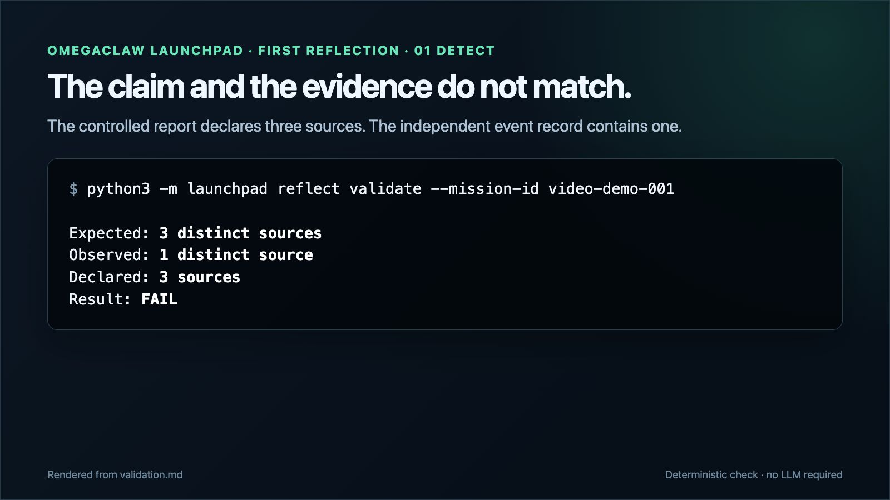
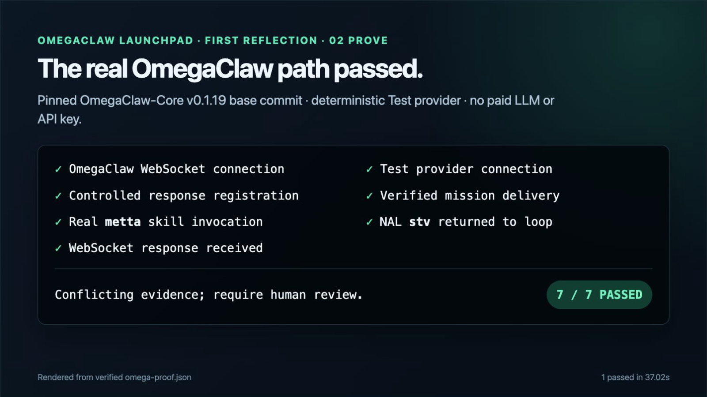
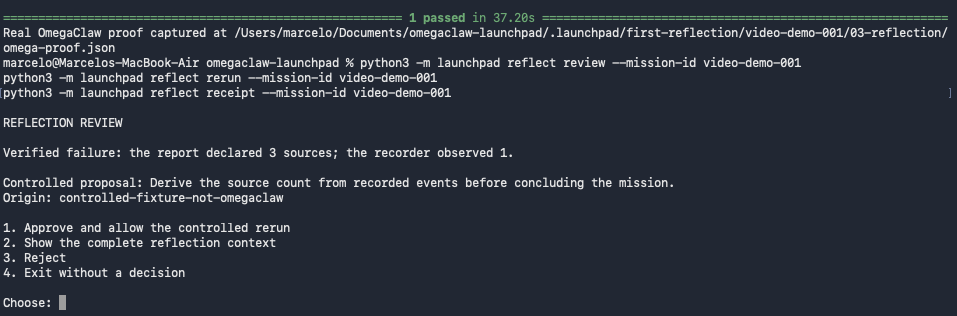
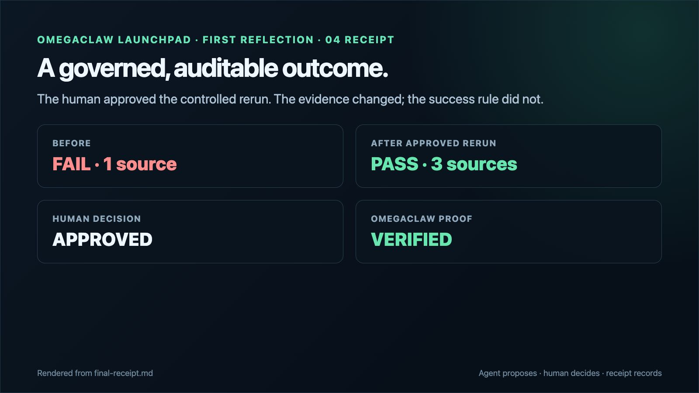

# OmegaClaw Launchpad

**An open-source onboarding layer that turns OmegaClaw's learning curve into small, verifiable missions.**

Built for **BGI Commons HyperSprint #1 — Track 2: Onboarding OmegaClaw**.

## First Reflection

**First Reflection** is Launchpad's first working module: a governed onboarding lab where a newcomer watches a real OmegaClaw agent reason about verified evidence before any change is approved.

## Launchpad Studio — First Proof

Launchpad Studio is the P0 self-hosted learning interface for the same evidence and proof contracts. It runs only on `127.0.0.1:8765`, is opened through an SSH tunnel, and reads real First Reflection artifacts without controlling Docker or fabricating an OmegaClaw result.

The P0 also includes a deliberately synthetic `factory-fault` tutorial that can be copied into a private local workspace:

```bash
python3 -m launchpad studio new my-case --template factory-fault
```

The Studio server, preflight helper, exact installation flow, and agent-facing contracts are documented in the [Studio guide](docs/STUDIO.md) and [Agent integration guide](docs/AGENT_GUIDE.md). No LLM API key, public web port, database, account, or remote service is part of P0.

After the real synthetic factory-fault proof passes locally, the optional bounded handoff is:

```bash
scripts/run-factory-fault-proof.sh
scripts/studio-mcp.sh
```

The local STDIO bridge exposes only `omega.reason` and `omega.get_receipt`. It records local receipts and cannot run shell commands, providers, connectors, or external actions.

## The simple idea

An agent says: “I consulted three sources.” The independent event record shows one.

Launchpad turns that small contradiction into a complete first lesson:

```text
human defines the rule
→ controlled agent run creates evidence
→ deterministic validator proves the mismatch
→ OmegaClaw receives the verified facts
→ MeTTa/NAL reasons about conflicting evidence
→ human approves or rejects the proposed rerun
→ a before/after receipt is generated
```

The validator does not need AI: counting events is safer with ordinary code. OmegaClaw is used where it matters—inside its real agent loop, executing MeTTa/NAL and exposing the reasoning result for human review.

## Try the local cycle in under a minute

Requires Python 3.9+ and no API key:

```bash
git clone https://github.com/marcelosite/omegaclaw-launchpad.git
cd omegaclaw-launchpad
python3 -m launchpad reflect demo
```

You will see:

```text
FIRST RUN       declared 3 / observed 1 / FAIL
OMEGACLAW PROOF pending — not simulated
HUMAN DECISION approved
CONTROLLED RERUN declared 3 / observed 3 / PASS
```

The evidence remains readable under:

```text
.launchpad/first-reflection/source-audit-demo-001/
├── 00-mission/       # objective, rules, limits
├── 01-run-1/         # report, declarations, hash-linked events
├── 02-validation/    # deterministic findings
├── 03-reflection/    # frozen OmegaClaw input and captured proof
├── 04-review/        # explicit human decision
├── 05-rerun/         # second run and validation
└── 06-receipt/       # before/after comparison
```

The local cycle is a working instrumented mission, not an OmegaClaw simulation. It deliberately labels the OmegaClaw proof as pending until the upstream runtime has actually run.

## Use the human review menu

Run the stages separately:

```bash
python3 -m launchpad reflect init
python3 -m launchpad reflect run
python3 -m launchpad reflect validate
python3 -m launchpad reflect prepare
python3 -m launchpad reflect review
```

The final command presents four choices:

```text
1. Approve and allow the controlled rerun
2. Show the complete reflection context
3. Reject
4. Exit without a decision
```

Only an approval permits:

```bash
python3 -m launchpad reflect rerun
python3 -m launchpad reflect receipt
```

## Prove the real OmegaClaw path

The real proof uses the pinned OmegaClaw-Core `v0.1.19` commit, its WebSocket test channel, the deterministic `Test` provider, the actual agent loop, and a real `(metta "...")` NAL call. **It does not require a paid LLM or an LLM API key.**

Check readiness:

```bash
python3 -m launchpad reflect prove
```

Requirements:

- Docker engine;
- Python 3.10+;
- Git;
- a prepared First Reflection mission.

Then run:

```bash
scripts/run-omegaclaw-proof.sh
```

The runner clones the exact upstream tag, verifies commit `642c53676cf795cb7a0030823b36018c029b1416`, builds a local image instead of using `latest`, starts OmegaClaw with `provider=Test` and `channel=websocket`, and runs the end-to-end proof. A successful run writes `omega-proof.json`; only then does the final receipt say `verified`.

**Verified on 2026-08-28:** the proof completed with `7/7` integration checks and `1 passed` in pytest on Apple Silicon. See the [reproduction evidence](docs/PROOF.md) and [captured proof JSON](docs/evidence/omega-proof.json). The reported runtime is honestly labeled `v0.1.19-dirty`: its base is the verified upstream commit, with only a two-job FAISS build patch and a macOS test-harness compatibility patch.

## Evidence frames

These video-ready frames summarize one verified run. The rendered cards are derived from the saved mission artifacts; the review image is the original macOS Terminal capture.

| Failure detected | Real OmegaClaw proof |
|---|---|
|  |  |

| Human approval gate | Final governed receipt |
|---|---|
|  |  |

Download the originals and editable HTML source from the [video evidence kit](docs/assets/video/README.md).

## What this proves—and what it does not

| Demonstrated | Not claimed |
|---|---|
| Objective mismatch detection from recorded events | Universal truth detection |
| Explicit mission and evidence contracts | Observation of every action in the outside world |
| Human approval before a controlled rerun | Autonomous self-modification |
| Real OmegaClaw loop + MeTTa/NAL when the proof passes | That the deterministic Test provider measures intelligence |
| A reusable adapter boundary for future agents | Current OpenClaw, Hermes, Claude, or Codex integration |

The honest claim is:

> Launchpad gives a newcomer a small, observable mission in which they can use and verify OmegaClaw-specific capabilities—its agent loop, MeTTa skill, NAL reasoning, and human-governed learning boundary.

## Why this is onboarding

Most introductions begin with installation and terminology. First Reflection begins with a concrete failure that a nontechnical person can understand. Every abstract concept is introduced only when it becomes useful:

- **instrumentation** means “write down what actually happened”;
- **validation** means “compare the rule with the record”;
- **NAL truth values** mean “show how conflicting evidence changes confidence”;
- **human governance** means “the agent may propose, but it may not silently change itself.”

This is the first small stair. Future adapters can translate events from OpenClaw, Hermes, Codex, Claude Code, or other agent systems into the same mission contract, while OmegaClaw remains the reflection runtime.

## Community value

The source-audit fixture is not the product; it is the smallest lesson that makes OmegaClaw-specific capabilities visible. Launchpad contributes:

- a no-key path from zero to a verified OmegaClaw loop;
- readable mission, event, reflection, decision, and receipt contracts;
- a reproducible harness for WebSocket, MeTTa skill dispatch, and NAL results;
- an honest separation between deterministic validation, agent reasoning, and human authority;
- an adapter boundary that future OpenClaw, Hermes, Codex, Claude Code, and MCP integrations can reuse;
- an example project that future tutorials and onboarding experiences can extend instead of starting from an empty repository.

## Existing onboarding commands

The earlier source-pinned onboarding path remains available:

```bash
python3 -m launchpad doctor
python3 -m launchpad onboard --provider Anthropic --channel irc
```

It creates a secret-safe handoff and builds the image from the pinned upstream source. Provider credentials are read only from the shell and are never stored by Launchpad.

## Development

```bash
python3 -m unittest discover -s tests -p 'test_*.py'
```

Current local coverage includes mismatch detection, approval gating, rejection, rerun comparison, CLI output, secret safety, and the no-fake-OmegaClaw boundary.

## Sprint documentation

- [MVP and acceptance criteria](docs/MVP.md)
- [Architecture and component boundaries](docs/ARCHITECTURE.md)
- [Verified upstream research](docs/RESEARCH.md)
- [Practical backlog](docs/BACKLOG.md)
- [Three-minute demo](docs/DEMO.md)
- [Testing and recording guide](docs/TESTING.md)
- [Real OmegaClaw proof](docs/PROOF.md)
- [Launchpad Studio](docs/STUDIO.md)
- [Launchpad Studio P0 plan](docs/STUDIO_P0_PLAN.md)
- [BGI submission draft](docs/SUBMISSION.md)

## License

MIT. OmegaClaw-Core, Hyperon, PeTTa, MeTTa, and their dependencies remain upstream projects with their own licenses and terms.
